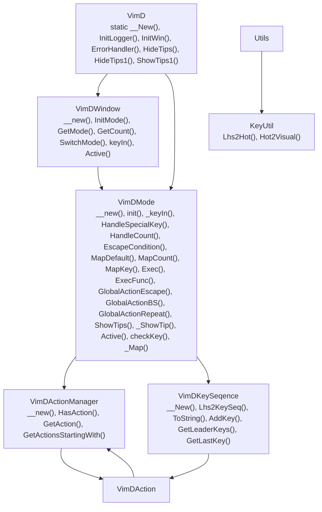

```mermaid
graph TD;
    VimD["VimD\nstatic __New(), InitLogger(), InitWin(), ErrorHandler(), HideTips(), HideTips1(), ShowTips1()"] --> VimDWindow;
    VimDWindow["VimDWindow\n__new(), InitMode(), GetMode(), GetCount(), SwitchMode(), keyIn(), Active()"] --> VimDMode;
    VimDMode["VimDMode\n__new(), init(), _keyIn(), HandleSpecialKey(), HandleCount(), EscapeCondition(), MapDefault(), MapCount(), MapKey(), Exec(), ExecFunc(), GlobalActionEscape(), GlobalActionBS(), GlobalActionRepeat(), ShowTips(), _ShowTip(), Active(), checkKey(), _Map()"] --> VimDActionManager;
    VimDActionManager["VimDActionManager\n__new(), HasAction(), GetAction(), GetActionsStartingWith()"] --> VimDAction;
    VimDMode --> VimDKeySeqence;
    VimDKeySeqence["VimDKeySeqence\n__New(), Lhs2KeySeq(), ToString(), AddKey(), GetLeaderKeys(), GetLastKey()"] --> VimDAction;
    VimDAction["VimDAction"] --> VimDActionManager;
    VimD --> VimDMode;
    Utils --> KeyUtil["KeyUtil\nLhs2Hot(), Hot2Visual()"];
```
